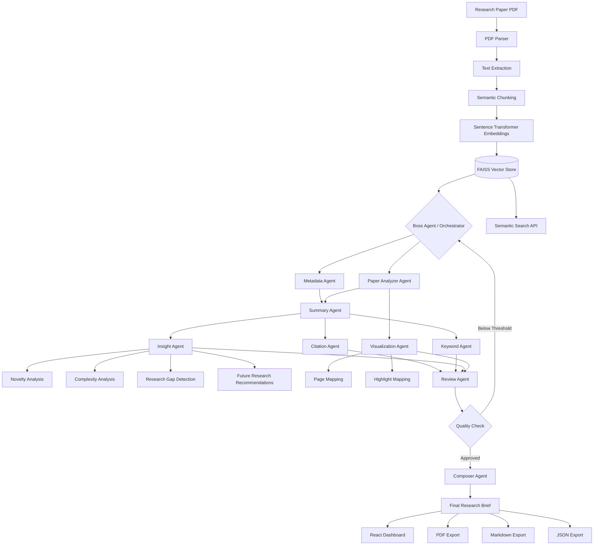
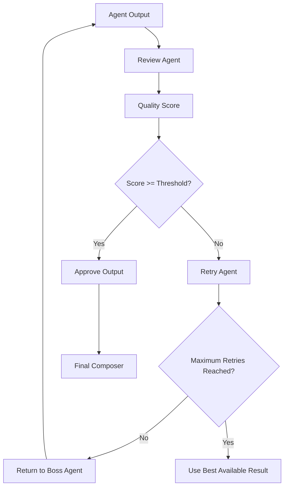

# PaperVision AI

### Intelligent Multi-Agent Research Paper Intelligence Platform

> **Turn a research paper into an intelligent, structured research brief using a local multi-agent AI system.**

PaperVision AI is an AI-powered research paper analysis platform that transforms complex academic PDFs into structured, explainable, and actionable research intelligence.

The platform uses an **11-agent LangGraph workflow** powered primarily by **Ollama + Qwen3:14B** to analyze research papers locally. Each agent performs a specialized task, while a central orchestration and quality-control system coordinates the workflow, evaluates agent outputs, and retries low-quality analysis when necessary.

The final result is presented through an interactive React dashboard containing:

* Research paper metadata
* Executive summary
* Section-by-section analysis
* Key citations
* Keyword extraction
* Research insights
* Novelty analysis
* Complexity analysis
* Research gap detection
* Future research recommendations
* Interactive workflow visualization
* Synchronized PDF viewer
* Semantic search across the paper
* Exportable research briefs

---

## Table of Contents

* [Why PaperVision AI?](#why-papervision-ai)
* [Core Features](#core-features)
* [System Architecture](#system-architecture)
* [Multi-Agent Workflow](#multi-agent-workflow)
* [Agent Responsibilities](#agent-responsibilities)
* [Quality Control and Retry Loop](#quality-control-and-retry-loop)
* [Technology Stack](#technology-stack)
* [Project Structure](#project-structure)
* [Application Workflow](#application-workflow)
* [Getting Started](#getting-started)
* [Environment Configuration](#environment-configuration)
* [API Documentation](#api-documentation)
* [Local AI with Ollama](#local-ai-with-ollama)
* [Semantic Search](#semantic-search)
* [Export Formats](#export-formats)
* [Docker Deployment](#docker-deployment)
* [Future Improvements](#future-improvements)
* [Design Decisions](#design-decisions)
* [Project Status](#project-status)
* [License](#license)

---

## Demo

<iframe width="640" height="381" src="https://www.loom.com/embed/6789788664ea428783b01194b6d63c3a" frameborder="0" webkitallowfullscreen mozallowfullscreen allowfullscreen></iframe>

---

## Why PaperVision AI?

Research papers are often difficult to understand quickly because useful information is distributed across multiple sections:

* Abstract
* Introduction
* Related Work
* Methodology
* Experiments
* Results
* Discussion
* Conclusion
* References

Traditional PDF readers only display the document. PaperVision AI transforms the document into an **intelligent research workspace**.

Instead of asking a single LLM to process the entire paper, the platform divides the analysis into specialized agents.

This approach provides:

### Specialized Analysis

Each agent focuses on one responsibility instead of performing every task at once.

### Better Explainability

The system can show how the final research brief was created.

### Local AI Processing

The primary analysis pipeline runs locally using Ollama and Qwen3:14B.

### Quality Control

A reviewer agent evaluates the quality of upstream agent outputs.

### Automatic Retry

Low-quality results can be sent back to the orchestration layer for reprocessing.

### Semantic Search

Users can search the research paper using natural-language queries.

---

# Core Features

## 1. PDF Research Paper Ingestion

Upload a research paper in PDF format.

The parser extracts:

* Text
* Page numbers
* Document structure
* Headings
* Paragraphs
* References

The extracted content is then processed into semantic chunks.

---

## 2. Multi-Agent AI Analysis

The paper passes through a coordinated agent workflow.

The platform currently includes specialized agents for:

* Metadata extraction
* Structural paper analysis
* Summarization
* Citation extraction
* Keyword mining
* Insight generation
* Visualization mapping
* Quality review
* Final composition
* Export generation

---

## 3. Semantic Chunking and Embeddings

The paper is divided into meaningful chunks.

Each chunk is converted into a vector embedding using Sentence Transformers.

These embeddings are stored in a FAISS vector index.

This enables semantic search such as:

```text
"What methodology did the authors use?"
```

or:

```text
"What are the limitations of this research?"
```

without requiring an exact keyword match.

---

## 4. Intelligent Research Brief

The final output combines all agent results into a structured research brief.

The brief can include:

* Paper title
* Authors
* Publication information
* Executive summary
* Problem statement
* Research methodology
* Key findings
* Important citations
* Keywords
* Research insights
* Novelty analysis
* Complexity analysis
* Research gaps
* Future research directions

---

## 5. Interactive Research Dashboard

The React frontend provides a visual research workspace.

The dashboard includes:

* PDF viewer
* Analysis results
* Agent status cards
* Workflow graph
* Summary cards
* Metadata cards
* Citation tables
* Keyword analysis
* Insight panels
* Section breakdowns
* Semantic search

---

## 6. Synchronized PDF Viewer

The PDF viewer is designed to connect analysis results with the original research paper.

This allows users to understand:

```text
AI-generated insight
        ↓
Relevant paper section
        ↓
Original source page
```

This improves transparency and makes the analysis more useful for academic research.

---

# System Architecture

The complete architecture follows a pipeline-based multi-agent design.



---

# Multi-Agent Workflow

The PaperVision AI workflow is coordinated using LangGraph.

The general execution flow is:

```text
PDF Upload
    ↓
Text Extraction
    ↓
Semantic Chunking
    ↓
Embedding Generation
    ↓
FAISS Vector Index
    ↓
Boss Agent
    ↓
Specialized Agents
    ↓
Review Agent
    ↓
Quality Evaluation
    ↓
Retry if Required
    ↓
Final Composer
    ↓
Research Brief
```

---

# Agent Responsibilities

## 1. Boss Agent

The Boss Agent is responsible for workflow orchestration.

Responsibilities:

* Initialize analysis
* Manage agent execution
* Track workflow state
* Coordinate retries
* Route low-quality outputs back into the workflow

The Boss Agent acts as the central controller of the multi-agent system.

---

## 2. Metadata Agent

Extracts structured information such as:

* Title
* Authors
* Publication date
* Venue
* DOI
* Research domain

---

## 3. Paper Analyzer Agent

Analyzes the overall structure of the research paper.

It identifies:

* Research problem
* Methodology
* Dataset
* Experiments
* Results
* Limitations
* Conclusions

---

## 4. Summary Agent

Generates structured summaries at multiple levels:

* Executive summary
* Section summary
* Methodology summary
* Results summary
* Conclusion summary

---

## 5. Citation Agent

Extracts and analyzes important citations.

The agent identifies:

* Referenced works
* Important papers
* Citation context
* Frequently referenced research

---

## 6. Keyword Agent

Extracts important keywords and concepts.

The output can be used for:

* Topic discovery
* Search
* Research categorization
* Semantic indexing

---

## 7. Insight Agent

Generates higher-level research intelligence.

It analyzes:

### Novelty

What is new about the research?

### Complexity

How complex is the methodology, implementation, or research problem?

### Research Gaps

What important questions remain unanswered?

### Future Directions

What research could be performed next?

---

## 8. Visualization Agent

Maps analytical information to the original paper.

It can identify:

* Important pages
* Relevant sections
* Key highlights
* Evidence locations

This helps connect generated insights back to the source document.

---

## 9. Review Agent

The Review Agent performs quality control.

Each agent output is evaluated using:

```text
Quality Score
Confidence Score
Validation Feedback
```

The reviewer determines whether the result should be:

```text
APPROVED
```

or:

```text
RETRY
```

---

## 10. Composer Agent

The Composer Agent combines all approved agent outputs.

It produces the final structured research brief.

The final brief is then used by:

* Dashboard
* Search
* Export services

---

## 11. Export Agent

Converts the final research brief into multiple formats:

* JSON
* Markdown
* PDF

---

# Quality Control and Retry Loop

One of the important design decisions in PaperVision AI is the use of a quality-control loop.

The system does not blindly trust every agent output.

The workflow is:



The default configuration is:

```env
REVIEW_QUALITY_THRESHOLD=0.75
MAX_AGENT_RETRIES=3
```

This creates a feedback loop:

```text
Agent
  ↓
Review
  ↓
Quality Score
  ↓
Retry if Necessary
  ↓
Approved Result
```

This architecture is designed to improve reliability and reduce the impact of weak individual agent outputs.

---

# Technology Stack

## Frontend

| Technology         | Purpose                |
| ------------------ | ---------------------- |
| React 19           | User interface         |
| Vite               | Frontend build tool    |
| Tailwind CSS       | Styling                |
| Framer Motion      | Animations             |
| React Flow         | Workflow visualization |
| React PDF / PDF.js | PDF rendering          |
| Recharts           | Data visualization     |
| Lucide Icons       | Interface icons        |
| Axios              | API communication      |

---

## Backend

| Technology            | Purpose                |
| --------------------- | ---------------------- |
| FastAPI               | REST API               |
| Python                | Backend language       |
| LangGraph             | Agent orchestration    |
| Pydantic              | Data validation        |
| PyMuPDF               | PDF processing         |
| pdfplumber            | PDF text extraction    |
| Sentence Transformers | Embeddings             |
| FAISS                 | Vector search          |
| SQLite                | Local persistence      |
| Ollama                | Local LLM runtime      |
| Qwen3:14B             | Primary local AI model |

---

# Project Structure

```text
PaperVision-AI/
│
├── Backend/
│   │
│   ├── app/
│   │   │
│   │   ├── agents/
│   │   │   ├── analyzer.py
│   │   │   ├── base.py
│   │   │   ├── boss_agent.py
│   │   │   ├── citation.py
│   │   │   ├── composer.py
│   │   │   ├── export.py
│   │   │   ├── insight.py
│   │   │   ├── keyword.py
│   │   │   ├── metadata.py
│   │   │   ├── reviewer.py
│   │   │   ├── summarizer.py
│   │   │   └── visualization.py
│   │   │
│   │   ├── api/
│   │   │   ├── routes_export.py
│   │   │   ├── routes_papers.py
│   │   │   └── routes_search.py
│   │   │
│   │   ├── embeddings/
│   │   │   └── embedding.py
│   │   │
│   │   ├── graph/
│   │   │   └── workflow.py
│   │   │
│   │   ├── parser/
│   │   │   └── pdf_parser.py
│   │   │
│   │   ├── services/
│   │   │   ├── gemini_client.py
│   │   │   └── ollama_client.py
│   │   │
│   │   ├── vectorstore/
│   │   │   └── faiss_store.py
│   │   │
│   │   └── main.py
│   │
│   ├── requirements.txt
│   ├── Dockerfile
│   └── .env.example
│
├── Frontend/
│   │
│   ├── src/
│   │   │
│   │   ├── components/
│   │   │   ├── AgentCard.jsx
│   │   │   ├── CitationTable.jsx
│   │   │   ├── InsightsPanel.jsx
│   │   │   ├── MetadataCard.jsx
│   │   │   ├── PDFViewer.jsx
│   │   │   ├── SectionBreakdown.jsx
│   │   │   ├── SummaryCard.jsx
│   │   │   ├── UploadBox.jsx
│   │   │   └── WorkflowGraph.jsx
│   │   │
│   │   ├── context/
│   │   │   └── AppContext.jsx
│   │   │
│   │   ├── pages/
│   │   │   ├── About.jsx
│   │   │   ├── Analysis.jsx
│   │   │   ├── Dashboard.jsx
│   │   │   ├── Landing.jsx
│   │   │   └── Upload.jsx
│   │   │
│   │   ├── services/
│   │   │   └── api.js
│   │   │
│   │   └── App.jsx
│   │
│   ├── package.json
│   └── Dockerfile
│
├── docker-compose.yml
├── .gitignore
└── README.md
```

---

# Application Workflow

## Step 1: Upload

The user uploads a research paper PDF.

```text
User
 ↓
React Upload Interface
 ↓
FastAPI Upload Endpoint
```

---

## Step 2: Extract

The backend extracts the paper's text and page structure.

```text
PDF
 ↓
PyMuPDF / pdfplumber
 ↓
Structured Text
```

---

## Step 3: Chunk

The document is divided into semantic chunks.

```text
Large Paper
 ↓
Meaningful Text Chunks
```

---

## Step 4: Embed

Each chunk is converted into a vector representation.

```text
Text Chunk
 ↓
Sentence Transformer
 ↓
Vector Embedding
```

---

## Step 5: Index

Embeddings are stored in FAISS.

```text
Embeddings
 ↓
FAISS Index
 ↓
Semantic Search
```

---

## Step 6: Analyze

The LangGraph workflow executes the specialized agents.

```text
Boss Agent
    ↓
Metadata
    ↓
Analysis
    ↓
Summary
    ↓
Citations + Keywords + Insights
    ↓
Visualization Mapping
```

---

## Step 7: Review

The Review Agent evaluates the quality of generated results.

```text
Agent Results
    ↓
Quality Evaluation
    ↓
Approved / Retry
```

---

## Step 8: Compose

The Composer Agent produces the final research brief.

```text
Approved Results
    ↓
Composer Agent
    ↓
Final Research Brief
```

---

# Getting Started

## Prerequisites

Install the following:

* Python 3.10+
* Node.js 18+
* npm
* Git
* Ollama

---

# Backend Setup

```bash
cd Backend
```

Create a virtual environment:

### Windows

```powershell
python -m venv .venv
.venv\Scripts\activate
```

### macOS / Linux

```bash
python -m venv .venv
source .venv/bin/activate
```

Install dependencies:

```bash
pip install -r requirements.txt
```

Create the environment file:

### Windows

```powershell
copy .env.example .env
```

### macOS / Linux

```bash
cp .env.example .env
```

Start the backend:

```bash
uvicorn app.main:app --reload --port 8000
```

Backend API:

```text
http://localhost:8000
```

API documentation:

```text
http://localhost:8000/docs
```

---

# Frontend Setup

Open a new terminal:

```bash
cd Frontend
npm install
npm run dev
```

Frontend:

```text
http://localhost:5173
```

The Vite development server proxies API requests to:

```text
http://localhost:8000
```

---

# Local AI with Ollama

PaperVision AI uses Ollama as its primary local AI provider.

Start Ollama:

```bash
ollama serve
```

Download the model:

```bash
ollama pull qwen3:14b
```

The application can then use:

```text
Qwen3:14B
    ↓
Ollama
    ↓
PaperVision AI Agents
```

Advantages:

* Local inference
* No mandatory external API calls
* Better privacy for research papers
* Lower dependency on cloud APIs

Gemini support remains available as an optional provider for future provider switching.

---

# Environment Configuration

Example:

```env
APP_ENV=development

OLLAMA_BASE_URL=http://localhost:11434
OLLAMA_MODEL=qwen3:14b

REVIEW_QUALITY_THRESHOLD=0.75
MAX_AGENT_RETRIES=3

GEMINI_API_KEY=
```

---

# API Documentation

## Upload a Paper

```http
POST /api/papers/upload
```

Uploads a research paper and returns a unique `paper_id`.

---

## Start Analysis

```http
POST /api/papers/{paper_id}/analyze
```

Starts the multi-agent LangGraph workflow.

---

## Get Analysis Result

```http
GET /api/papers/{paper_id}
```

Returns the composed research analysis.

---

## Semantic Search

```http
GET /api/search/{paper_id}?q=research methodology
```

Searches the paper semantically using the FAISS vector store.

---

## Export Results

```http
GET /api/export/{paper_id}/json
```

```http
GET /api/export/{paper_id}/markdown
```

```http
GET /api/export/{paper_id}/pdf
```

---

# Semantic Search Architecture

PaperVision AI uses a retrieval pipeline:

```text
User Query
    ↓
Query Embedding
    ↓
FAISS Similarity Search
    ↓
Relevant Paper Chunks
    ↓
Search Results
```

For example:

```text
Query:
"What are the limitations of this research?"
```

The system searches for semantically relevant sections even if the exact phrase does not appear in the document.

---

# Export Formats

The final research brief can be exported as:

## JSON

Useful for:

* APIs
* Integrations
* Data pipelines
* Future AI agents

## Markdown

Useful for:

* Notes
* Documentation
* GitHub
* Research workflows

## PDF

Useful for:

* Sharing
* Academic documentation
* Offline reading
* Reports

---

# Docker Deployment

Build and start all services:

```bash
docker compose up --build
```

Stop services:

```bash
docker compose down
```

The Docker architecture is:

```text
Frontend Container
        ↓
Backend Container
        ↓
Ollama / AI Runtime
        ↓
Local AI Model
```

---

# Design Decisions

## Why Multi-Agent Architecture?

A single general-purpose LLM call can produce inconsistent results.

PaperVision AI divides the workflow into specialized responsibilities.

This improves:

* Modularity
* Debugging
* Explainability
* Extensibility
* Quality control

---

## Why LangGraph?

LangGraph provides a structured way to represent:

* Agent nodes
* Workflow state
* Conditional execution
* Retry loops
* Multi-step orchestration

This makes it suitable for a stateful multi-agent research workflow.

---

## Why Ollama?

The primary goal of PaperVision AI is to support local analysis.

Ollama provides:

* Local model execution
* Privacy
* Easy model switching
* Developer-friendly APIs

---

## Why FAISS?

FAISS provides efficient vector similarity search.

It is suitable for:

* Local deployments
* Research documents
* Semantic search
* Retrieval pipelines

---

# Future Improvements

Planned improvements include:

* Multi-document comparison
* Research paper clustering
* Knowledge graph generation
* Automatic related-paper discovery
* Cross-paper citation analysis
* RAG-based question answering
* User authentication
* Persistent database storage
* Cloud deployment
* Streaming agent execution
* Agent-level observability
* Evaluation benchmark suite
* Support for additional local models
* Improved citation grounding
* Automatic reference validation

---

# Project Status

| Feature                  | Status                |
| ------------------------ | --------------------- |
| PDF Upload               | Completed             |
| PDF Text Extraction      | Completed             |
| Semantic Chunking        | Completed             |
| Embedding Generation     | Completed             |
| FAISS Vector Search      | Completed             |
| Multi-Agent Workflow     | Completed             |
| Local Ollama Integration | Completed             |
| Qwen3:14B Support        | Completed             |
| Quality Review Loop      | Completed             |
| Retry Mechanism          | Completed             |
| Interactive Dashboard    | Completed             |
| PDF Viewer               | Completed             |
| Semantic Search          | Completed             |
| JSON Export              | Completed             |
| Markdown Export          | Completed             |
| PDF Export               | Completed             |
| Gemini Provider          | Optional / Configured |

---

# Submission Summary

PaperVision AI demonstrates an end-to-end AI agent system designed for research intelligence.

The system combines:

```text
Document Processing
        +
Semantic Retrieval
        +
Multi-Agent Orchestration
        +
Local LLM Inference
        +
Quality Control
        +
Interactive Visualization
```

The result is a complete research paper intelligence platform that transforms an unstructured PDF into a structured, searchable, explainable, and exportable research brief.

---

# License

MIT License

Built as an AI Agent Developer take-home submission.

---

## Author

**Jatin Shewale**

PaperVision AI — Intelligent Multi-Agent Research Paper Intelligence Platform
